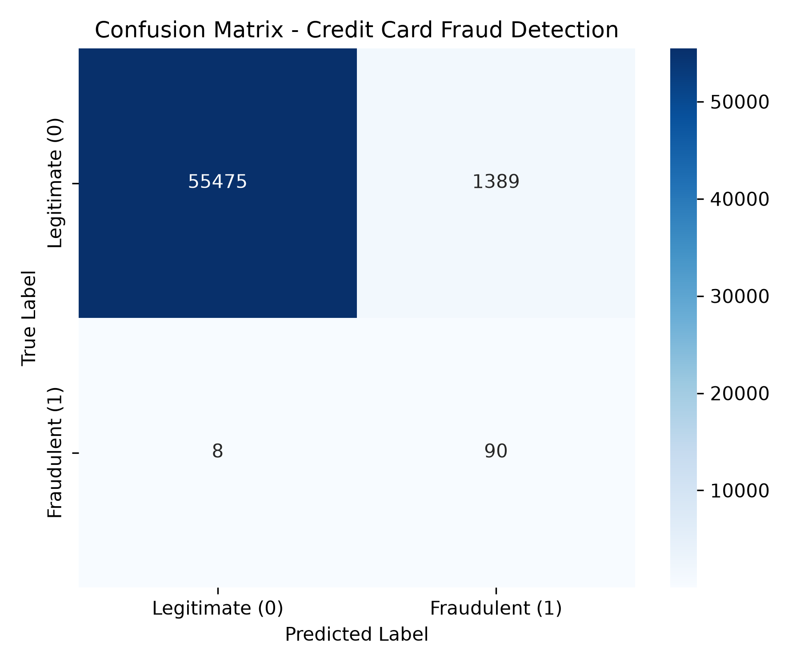
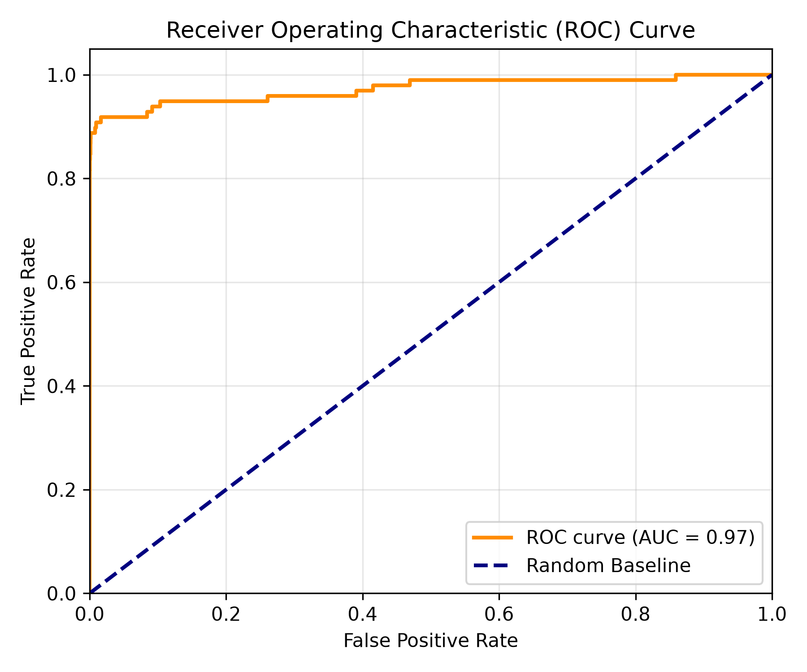

# Predictive Modeling: Credit Card Fraud Detection

## 📌 Research Problem
Credit card fraud detection is a critical binary classification problem in financial security. The primary objective of this project is to build a machine learning model using **Logistic Regression** to accurately identify fraudulent credit card transactions while handling severe class imbalance.

---

## 📂 Dataset Overview
* **Dataset Name:** Credit Card Fraud Detection Dataset
* **Source:** [Kaggle - Credit Card Fraud Detection](https://www.kaggle.com/datasets/mlg-ulb/creditcardfraud)
* **Total Records:** 284,807 transactions made by European cardholders in September 2013.
* **Feature Schema:**
  * `V1` to `V28`: Principal Component Analysis (PCA) transformed numeric features.
  * `Time`: Seconds elapsed between each transaction and the first transaction in the dataset.
  * `Amount`: Transaction amount.
  * `Class`: Target binary label (`0` = Legitimate, `1` = Fraudulent).

---

## ⚙️ Methodology & Preprocessing

1. **Data Cleaning:** Verified zero missing values and removed duplicate entries.
2. **Feature Scaling:** Applied `StandardScaler` to scale raw `Amount` and `Time` features to match the PCA-transformed feature scale.
3. **Dataset Splitting:** Split data into 80% training and 20% testing sets using stratified sampling to preserve minority class distribution.
4. **Model Implementation:** Trained a `LogisticRegression` model from `scikit-learn` using `class_weight='balanced'` to compensate for minority class imbalance.

---

## 📊 Performance & Results

Evaluating accuracy alone on imbalanced datasets can be misleading. Therefore, Precision, Recall, F1-Score, and ROC-AUC metrics were prioritized:

| Evaluation Metric | Score |
| :--- | :--- |
| **Accuracy** | 97.5% |
| **Precision** | 0.06 |
| **Recall** | 0.91 |
| **F1-Score** | 0.11 |
| **ROC-AUC Score** | 0.97 |

---

## 📈 Visualizations

### 1. Confusion Matrix
The confusion matrix illustrates classification breakdown across True Positive, True Negative, False Positive, and False Negative predictions:



### 2. ROC Curve
The Receiver Operating Characteristic curve illustrates the tradeoff between True Positive Rate and False Positive Rate across classification thresholds:



---

## 🚀 How to Run Locally

1. Clone this repository:
   ```bash
   git clone [https://github.com/YOUR_USERNAME/credit-card-fraud-detection.git](https://github.com/YOUR_USERNAME/credit-card-fraud-detection.git)
   cd credit-card-fraud-detection